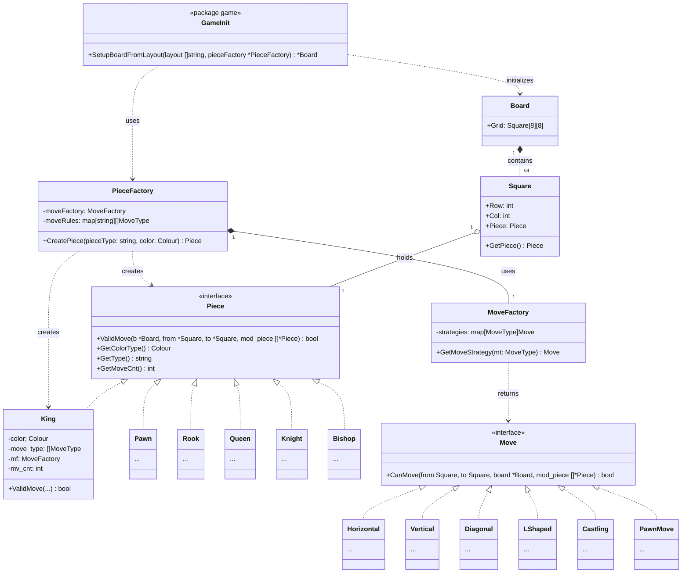

# Chess LLD: Current Architecture and Next Steps

## 1. Current Architecture Diagram

Here is a Mermaid class diagram representing the architecture you have built so far:

### Architecture Summary So Far:
You have cleanly separated the concerns using standard design patterns:
*   **Strategy Pattern (`moves/`)**: Different move logic (horizontal, diagonal, etc.) are encapsulated into separate strategies.
*   **Factory Pattern (`pieces/` & `moves/`)**: `PieceFactory` abstracts piece creation and injects the necessary move rules, while `MoveFactory` provides the right move strategy.
*   **Models (`models/`)**: Contains the core domain entities (`Board`, `Square`, `Piece` interface).

---

## 2. Plan Going Forward

Abhi tak aapne board setup, pieces, aur unke move validation (CanMove/ValidMove) ka logic likh liya hai. Ab actual game ko run karne ke liye state management aur game loop likhne ki zaroorat hai.

Here is the step-by-step plan:

### Step 1: Move Execution (Apply Move)
Abhi tak sirf validation hai (`CanMove`). Ek function chahiye jo actually board pe piece ko ek square se doosre square pe move kare.
*   **Create `MakeMove(from, to)`**:
    *   Update `Square.Piece` pointers.
    *   Handle Captures (if a piece is killed, remove it from the board).
    *   Increment piece's move count (`mv_cnt`).
    *   Special Moves execution: Handle En Passant, Pawn Promotion, and moving the Rook during Castling.

### Step 2: Game State Management (Game Orchestrator)
Aapko ek `Game` struct chahiye jo pure game ko control kare.
*   **State properties**: `CurrentTurn` (White/Black), `Board`, `Status` (Active, Checkmate, Stalemate, Draw), `MoveHistory` (to track all moves for undo/en passant/threefold repetition).
*   **Methods**:
    *   `PlayMove(player, from, to)`: Validates if it's the correct player's turn, validates the move via pieces, executes it, and switches turns.

### Step 3: Check and Checkmate Detection
Game of chess is incomplete without Check/Checkmate validation.
*   **IsKingInCheck()**: After every move, check if the current player's King is under attack by any opponent's piece. If a move puts your own King in check, it should be marked as an invalid move.
*   **IsCheckmate() / IsStalemate()**: Logic to iterate over all possible moves for the current player to see if any move can save the King.

### Step 4: Input / Output (CLI & Main Loop)
Update `main.go` to have a running game loop.
*   Print the board to the console so the user can see it.
*   Take user input (e.g., standard algebraic notation like `e2 e4` or `(6,4) to (4,4)`).
*   Parse the input and call `PlayMove`.

### Step 5: Edge Cases & Polish
*   **Pawn Promotion**: Ask the user which piece they want to promote to.
*   **En Passant Validation**: The `PawnMove` needs to know the history of the last move to allow En Passant.

**Recommendation on what to tackle first:** Start with **Step 1 (Move Execution)** and **Step 2 (Game State)**. Create a simple `Game` struct in `game/game.go` and add a method to apply a move on the board!
