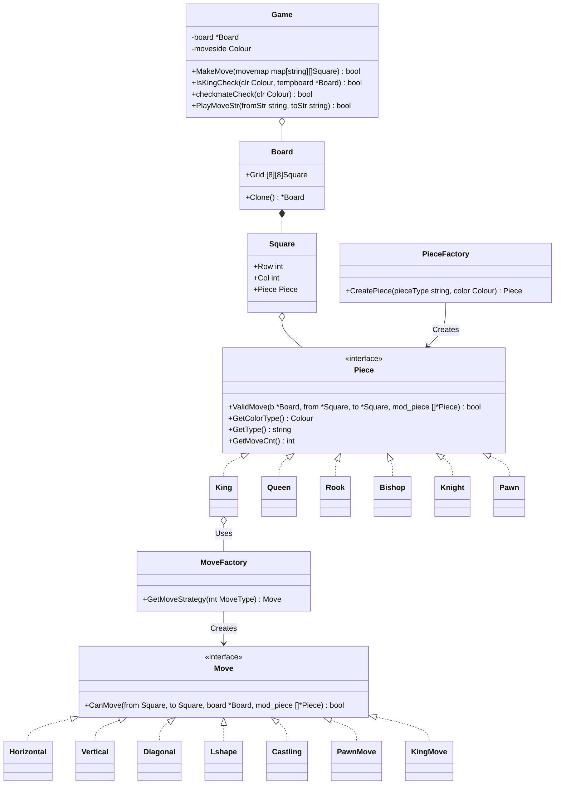

# Chess LLD (Low-Level Design) - Revision Notes ♟️

Yeh document specifically LLD interviews ke time par revise karne ke liye banaya gaya hai. Isme aapke code ka structure, design choices, interview POV, aur future scope detailed format mein hai.

---

## 🏛️ Architecture & Diagram (Mermaid)

Yahan aapke code ka object-oriented structure hai. Is diagram ko samajhna interview ke liye sabse zaroori hai.

---

## 💡 Kya Sahi Cheezein Hain? (Strengths & Best Practices)

Aapne LLD ke sabse important design patterns implement kiye hain:

1. **Strategy Pattern (Movement Logic):** 
   Aapne har move (`Horizontal`, `Diagonal`, `LShaped`) ko alag strategy struct mein toda. Ek Piece sirf batata hai ki wo kaunse moves janta hai. **Fayda:** Kal ko agar interviewer bole ki "Ek naya piece dalo jo Ghode (Knight) aur Hathi (Rook) dono ki tarah chalta ho", toh aapko naya code nahi likhna, bas `PieceFactory` mein usko `[models.LShaped, models.Horizontal, models.Vertical]` dena hoga.
2. **Factory Pattern:**
   Aapne `PieceFactory` aur `MoveFactory` banaye. Isse `Game` class ko is baat ka tension nahi lena padta ki objects kaise banenge.
3. **Immutability & State Management (Cloning):**
   Aapne board ko clone karna (`tempboard := g.board.Clone()`) seekha. Chess mein "kya move karne par mujhe Check padega?" yeh jaanne ke liye future state simulate karni padti hai, jiska sabse sahi tareeka Board Cloning hai.
4. **Open-Closed Principle (SOLID):**
   Aapka system nayi functionalities add karne ke liye OPEN hai, par existing classes ko modify kiye bina (CLOSED for modification).

---

## 🚨 Kya Galat Hua / Seekhne Wali Cheezein (Mistakes & Lessons)

1. **Dangling Pointers (Stale State):**
   Shuru mein humne `g.whiteKingLoc` aur `g.blackKingLoc` ke pointer store kiye. Lekin jab board clone hota tha, toh pointers purane board ke squares par hi atke reh jaate the.
   * **Lesson:** Jab aap bada Object (Board) clone karte ho, toh uske andar ke kisi element ka direct Pointer mat rakho. Uski jagah dynamic function (`findKing()`) banao.
2. **Missing Validations in Controller (`MakeMove`):**
   Ek bug tha jisme White, Black ka piece chala raha tha.
   * **Lesson:** Kabhi bhi interface par trust mat karo. Game State modify hone se pehle har strict check hona chahiye (e.g., `if piece.Color != currentTurn { return false }`).
3. **Defensive Programming (Nil Pointers):**
   Jab `KingMove` ko map mein daalna bhool gaye, toh `nil` interface se panics aane lage. 
   * **Lesson:** Map se return aane wali values hamesha check karo `if strategy != nil { ... }`.

---

## 🎤 Detailed Interview Point of View (POV)

Jab aap interview mein ye design samjhayenge, toh is script ka use karein:

* **Interviewer:** *"Walk me through your Chess LLD."*
* **Aap:** *"Maine chess board ko `Board` aur `Square` structs mein design kiya hai. Lekin meri core architecture **Strategy aur Factory Design Patterns** par based hai. Maine pieces aur unke movement rules ko tightly couple nahi kiya. Balki, maine `Move` interface banaya hai jiske implementations hain `Horizontal`, `Diagonal`, etc. Ek `PieceFactory` jab koi piece (e.g. Queen) banati hai, toh usko `Horizontal`, `Vertical`, aur `Diagonal` strategies inject karti hai. Isse code highly reusable banta hai."*

* **Interviewer:** *"How do you handle checkmate?"*
* **Aap:** *"Main Board ki ek copy (Clone) banata hoon. Phir current player ke har ek piece ko board ke saare 64 squares par virtual move kara ke dekhta hoon. Agar `tempboard` par us move se mera King safe ho raha hai, toh it's NOT a checkmate. Agar board ka har permutation try karne ke baad bhi safe move nahi milti, toh woh Checkmate hai."*

---

## 🚀 Extra Information (Future Scope)

Agar aapko is project ko ekdum Pro-level le jana hai (ya interviewer puche ki "Aur kya add karoge?"):

1. **Pawn Special Moves:** 
   * **En Passant:** Iske liye aapko Game ki History track karni padegi ki pichla move kaunsa hua tha.
   * **Promotion:** Jab pawn row 0 ya 7 par pahuche, toh Prompt/UI dekar PieceSwap logic lagana.
2. **Move History Logger (Undo feature):**
   * Ek `[]map[string][]models.Square` array banakar har valid move ko push karna. Isse Undo (Ctrl+Z) function banana aasan ho jayega aur PGN format me game save ho sakegi.
3. **Game States (Stalemate / Draw Rules):**
   * **Stalemate:** Agar King par check nahi hai aur player ke paas chalne ki jagah nahi hai.
   * **50-Move Rule & 3-Fold Repetition:** History track karke dekhna ki kya same board state 3 baar ban chuki hai.
4. **Concurrency (Minimax Algorithm):**
   * Go ki sabse badi takat *Goroutines* hain. Hum AI opponent bana sakte hain jo `checkviaTempBoard` ko goroutines mein chala ke agle 3 moves deeply calculate karega (Tree search).

---

## 📊 Self-Evaluation & Improvement Path (SDE Level)

Based on the codebase, here is an objective assessment of the skills demonstrated:

* **High-Level / System Design (SDE-2 Level):** Aapka OOD (Object-Oriented Design) bohot strong hai. Strategy aur Factory pattern ka use exactly waisa hi hai jaisa top product companies (Amazon, Uber, Microsoft) apne LLD rounds mein expect karti hain.
* **Low-Level / Execution (SDE-1 Level):** Logical edge cases, pointer states, aur defensive programming mein thoda struggle hai.

### Kaise Improve Karein? (Actionable Advice)
1. **The "What if this is NIL?" Mental Checklist:** Jab bhi map, array ya pointer se koi value nikalo, humesha ek `nil` check lagao (Code Ref: `pieces/king.go:28` jahan map se strategy missing thi aur program crash hua).
2. **Think about Side-Effects:** Jab bhi aap state change karte ho (e.g. `g.board = tempboard`), hamesha socho ki "Mere struct mein aur kaunse pointers hain jo abhi bhi purane data ko point kar rahe hain?" (Code Ref: `g.whiteKingLoc` pointer bug).
3. **Negative Testing:** Apna code hamesha galat input daal kar test karo (e.g. "Kya main opponent ka piece hila sakta hoon?").

---

## 🧠 Architecture Insights: The `tempboard` Approach

Aapne Check/Checkmate evaluate karne ke liye Board Cloning ka tareeka apnaya (Code Ref: `game/game.go` mein `tempboard := g.board.Clone()`). 

### Pros (Why it's BEST for Interviews):
* **Immutability (Safety):** Original board ka data kabhi corrupt nahi hoga. Agar hypothetical move galat nikla, toh bas clone ko discard kar do. Complex rollback ya "Undo" logic nahi likhna padta.
* **Readable Code:** Interviewer ko code dekh kar 1 second mein samajh aa jayega ki aap "Parallel Universe" create karke future predict kar rahe ho.

### Cons (Why Real Chess Engines Don't Use It):
* **Performance Hit (Garbage Collection):** Har ek possible move ke liye pura 8x8 array clone karna expensive hai. Checkmate evaluate karte waqt ~40 baar board clone hota hai. Agar aap aage 5 turns predict karne wala AI banaoge (Minimax), toh millions of boards clone honge aur program bohot slow ho jayega.

### 🏆 Pro-Tip for Interview:
Agar interviewer puche *"Is this efficient?"*, toh aap ye answer dena:
> *"For a standard multiplayer backend, cloning is slightly memory intensive but keeps the code extremely clean and bug-free by preventing state corruption. However, if performance becomes a bottleneck (like building a Chess AI), I would swap this out for a **MakeMove/UnmakeMove** pattern (where we reverse the move on the same board) or use **Bitboards** (representing the board using 64-bit integers and bitwise operations)."*
Yeh answer aapko direct extra points dilayega!
