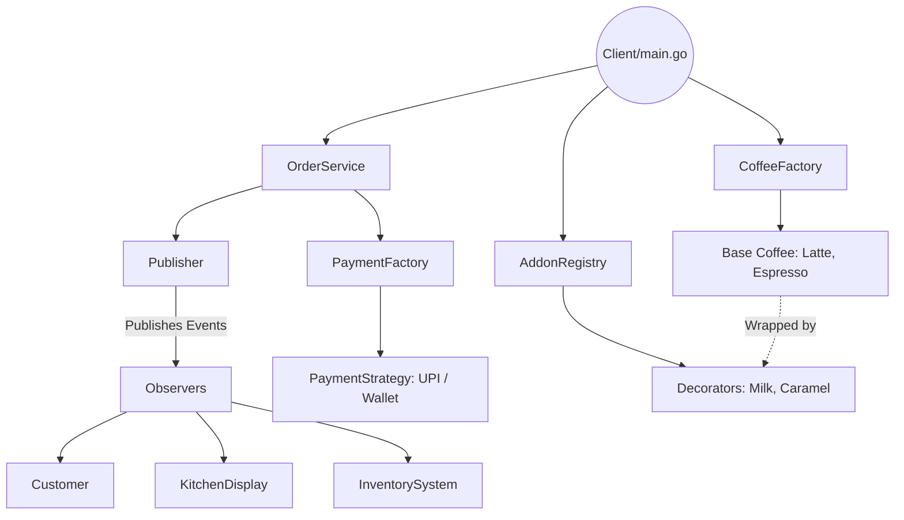

# Coffee Shop POS System - Low Level Design (LLD)

This repository contains a modular, production-ready Point of Sale (POS) system for a Coffee Shop, built in Go. The architecture heavily leverages Object-Oriented Design (OOD) principles and multiple Gang of Four (GoF) design patterns to ensure the system is extensible, loosely coupled, and easy to test.

## System Architecture



## Dissecting the Design Patterns

This system applies several core design patterns to solve common architectural problems efficiently.

### 1. Decorator Pattern
**Problem:** We have base coffees (Espresso, Latte) and dozens of addons (Milk, Caramel, Whipped Cream). Creating a subclass for every combination (`LatteWithMilkAndCaramel`) leads to a class explosion.
**Solution:** We use the Decorator Pattern to dynamically wrap the base coffee with addons at runtime. Both the base coffee and the addons implement the same `CoffeeItem` interface.

```go
type CoffeeItem interface {
	CoffeeItem() string
	price() int
}

// Decorator wrapping a base CoffeeItem
type Milk struct {
	coffee CoffeeItem
}

func (m *Milk) CoffeeItem() string {
	return m.coffee.CoffeeItem() + " + Milk"
}
func (m *Milk) price() int {
	return m.coffee.price() + 2
}
```

### 2. Strategy Pattern
**Problem:** Payment logic varies wildly based on the method (UPI, Wallet, Credit Card). Hardcoding these into the `OrderService` creates massive, unmaintainable if-else blocks.
**Solution:** Extract payment logic into a `PaymentStrategy` interface. The `OrderService` depends on the interface, not the concrete implementations, adhering to the Open-Closed Principle.

```go
type PaymentStrategy interface {
	pay(order *Order) int
}

type UPI struct{}
func (u *UPI) pay(order *Order) int {
	return order.Product.price() // Custom UPI logic
}
```

### 3. Factory & Registry Patterns
**Problem:** We need a centralized way to instantiate Objects (Coffees, Payments) without scattering `New()` calls throughout the codebase. Furthermore, hardcoding a switch statement for addons violates the Open-Closed Principle.
**Solution:**
- **Factory:** `PaymentFactory` handles the creation of `PaymentStrategy`.
- **Registry:** `addonRegistry` maps string names to creator functions. New addons can be registered at runtime (e.g., in an `init()` block) without modifying the core lookup logic.

```go
// Registry mapping
type AddonRegistry struct {
	addons map[string]func(CoffeeItem) CoffeeItem
}

func (r *AddonRegistry) Register(name string, creator func(CoffeeItem) CoffeeItem) {
	r.addons[name] = creator
}
```

### 4. Observer Pattern (Pub/Sub)
**Problem:** When an order is created or paid, multiple downstream systems (Kitchen Display, Inventory, Customer App) need to react. Tying them directly to `OrderService` creates tight coupling.
**Solution:** `OrderService` pushes typed `Event` structs to a `Publisher`. The `Publisher` iterates through subscribed `Observers`, which use type-switching to selectively consume only the events they care about.

```go
// Event Interface & Struct
type Event interface {
	EventName() string
}
type OrderProcessingEvent struct {
	*Order
	ItemName string
}

// Selective Consumption via Type Switch
func (k *KitchenDisplay) Update(e Event) {
	switch event := e.(type) {
	case OrderReceivedEvent, OrderProcessingEvent:
		fmt.Printf("[Kitchen Display %s] Notification: %s\n", k.ID, event.EventName())
	}
}
```

## The Order Lifecycle (Orchestration)
The `OrderService` acts as the orchestrator. It uses Dependency Injection (DI) to receive its required `Publisher` and `PaymentFactory`. 

1. **`CreateOrder()`**: Initializes the `Order` struct and broadcasts `OrderReceivedEvent`.
2. **`PayOrder()`**: Dynamically resolves the `PaymentStrategy`, executes the payment, and broadcasts `PaymentProcessedEvent`.
3. **`processOrder()`**: Handles the state transition (`Pending` -> `Processing` -> `Completed`), emitting specific typed events along the way.
