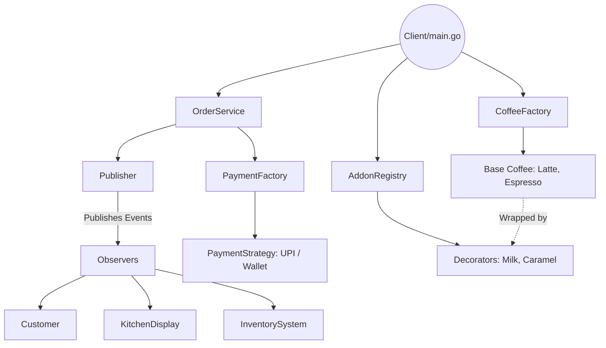

# Starbrew Coffee - High-Concurrency POS System (LLD)

**Project Name:** Starbrew POS (Point of Sale) Engine  
**Language:** Go (Golang)  

## Problem Statement
Design a highly scalable, concurrent, and extensible Point of Sale (POS) system for a Coffee Shop. The system must fulfill the following technical requirements:
1. **Dynamic Menu (Open-Closed Principle):** Support a base coffee (Espresso, Latte) with an infinite, dynamic combination of add-ons (Milk, Caramel, Vanilla) without suffering from class explosion.
2. **Pluggable Payments:** Support multiple payment gateways (UPI, Credit Card, Wallet, COD) that can be swapped out or extended easily.
3. **Event-Driven Orchestration:** Automatically notify downstream systems (Kitchen Display, Inventory System, Customer App) when an order state changes, without tightly coupling them to the core order processing logic.
4. **Thread Safety & Concurrency:** Handle thousands of concurrent requests safely. Prevent critical business bugs like "Double Spending" (Idempotency failures) or "Time-Of-Check-To-Time-Of-Use" (TOCTOU) data races when multiple users/goroutines attempt to pay for or cancel the exact same order simultaneously.

---

This repository contains a modular, production-ready implementation solving the above problem statement. The architecture heavily leverages Object-Oriented Design (OOD) principles and multiple Gang of Four (GoF) design patterns to ensure the system is extensible, loosely coupled, and easy to test.

## System Architecture



## Dissecting the Design Patterns

This system applies several core design patterns to solve common architectural problems efficiently.

### 1. Decorator Pattern
**Problem:** We have base coffees (Espresso, Latte) and dozens of addons (Milk, Caramel, Whipped Cream). Creating a subclass for every combination (`LatteWithMilkAndCaramel`) leads to a class explosion.
**Solution:** We use the Decorator Pattern to dynamically wrap the base coffee with addons at runtime. Both the base coffee and the addons implement the same `CoffeeItem` interface.

```go
type CoffeeItem interface {
	CoffeeItem() string
	price() int
}

// Decorator wrapping a base CoffeeItem
type Milk struct {
	coffee CoffeeItem
}

func (m *Milk) CoffeeItem() string {
	return m.coffee.CoffeeItem() + " + Milk"
}
func (m *Milk) price() int {
	return m.coffee.price() + 2
}
```

### 2. Strategy Pattern
**Problem:** Payment logic varies wildly based on the method (UPI, Wallet, Credit Card). Hardcoding these into the `OrderService` creates massive, unmaintainable if-else blocks.
**Solution:** Extract payment logic into a `PaymentStrategy` interface. The `OrderService` depends on the interface, not the concrete implementations, adhering to the Open-Closed Principle.

```go
type PaymentStrategy interface {
	pay(order *Order) int
}

type UPI struct{}
func (u *UPI) pay(order *Order) int {
	return order.Product.price() // Custom UPI logic
}
```

### 3. Factory & Registry Patterns
**Problem:** We need a centralized way to instantiate Objects (Coffees, Payments) without scattering `New()` calls throughout the codebase. Furthermore, hardcoding a switch statement for addons violates the Open-Closed Principle.
**Solution:**
- **Factory:** `PaymentFactory` handles the creation of `PaymentStrategy`.
- **Registry:** `addonRegistry` maps string names to creator functions. New addons can be registered at runtime (e.g., in an `init()` block) without modifying the core lookup logic.

```go
// Registry mapping
type AddonRegistry struct {
	addons map[string]func(CoffeeItem) CoffeeItem
}

func (r *AddonRegistry) Register(name string, creator func(CoffeeItem) CoffeeItem) {
	r.addons[name] = creator
}
```

### 4. Observer Pattern (Pub/Sub)
**Problem:** When an order is created or paid, multiple downstream systems (Kitchen Display, Inventory, Customer App) need to react. Tying them directly to `OrderService` creates tight coupling.
**Solution:** `OrderService` pushes typed `Event` structs to a `Publisher`. The `Publisher` iterates through subscribed `Observers`, which use type-switching to selectively consume only the events they care about.

```go
// Event Interface & Struct
type Event interface {
	EventName() string
}
type OrderProcessingEvent struct {
	*Order
	ItemName string
}

// Selective Consumption via Type Switch
func (k *KitchenDisplay) Update(e Event) {
	switch event := e.(type) {
	case OrderReceivedEvent, OrderProcessingEvent:
		fmt.Printf("[Kitchen Display %s] Notification: %s\n", k.ID, event.EventName())
	}
}
```

## The Order Lifecycle (Orchestration)
The `OrderService` acts as the orchestrator. It uses Dependency Injection (DI) to receive its required `Publisher` and `PaymentFactory`. 

1. **`CreateOrder()`**: Initializes the `Order` struct and broadcasts `OrderReceivedEvent`.
2. **`PayOrder()`**: Dynamically resolves the `PaymentStrategy`, executes the payment, and broadcasts `PaymentProcessedEvent`.
3. **`processOrder()`**: Handles the state transition (`Pending` -> `Processing` -> `Completed`), emitting specific typed events along the way.

---

## Concurrency & Thread Safety Deep Dive (Staff Engineer Level)

Ek production-grade system sirf design patterns se nahi banta, balki wo concurrent environment (e.g. 10,000 HTTP requests/second) mein kaise behave karega, uspe depend karta hai. Is project mein humne deep concurrency issues ko identify aur solve kiya hai.

### 1. Data Races & Fine-Grained Locking (`sync.Mutex`)
Jab ek hi `Order` ko alag-alag Goroutines (Barista processing vs Customer cancelling) ek sath modify karti hain, toh **Data Race** hota hai jisse Go panic kar sakta hai.
**Solution:** Humne `Order` struct mein ek `sync.RWMutex` add kiya hai.
- **Fine-Grained Locking:** Humne `Lock()` sirf utni der ke liye lagaya hai jitni der memory state (jaise `PaymentStatus`) update ho rahi ho. Network I/O ya Payment Gateway calls (jo 5-10 seconds le sakte hain) ke dauran lock **nahi** lagaya gaya hai taaki HTTP threads block na ho (Deadlock/Contention prevention).

```go
// Good Practice: Lock sirf state check aur set karne ke liye
order.mu.Lock()
if order.PaymentStatus == PaidP {
    order.mu.Unlock()
    return nil, fmt.Errorf("Already paid")
}
order.PaymentStatus = ProcessingPaymentP
order.mu.Unlock() // Network call se pehle lock release!

start.pay(order) // I/O bina kisi contention ke
```

### 2. Solving the "Double Spend" / Idempotency Problem
Agar kisi user ne ghabra kar 3 baar "Pay" button daba diya, toh teen concurrent requests aayengi. Agar lock turant khol diya gaya, toh teeno requests validation pass karke 3 baar payment gateway ko call kar dengi!
**Solution:** Humne ek intermediate **In-Flight State** (`ProcessingPaymentP`) introduce ki hai. Ye act karti hai as an **Optimistic Lock Flag**. Agar pehli thread ne state ko `Processing` mark kar diya, toh baaki ki threads validation check me hi fail ho jayengi.

### 3. TOCTOU (Time-Of-Check-To-Time-Of-Use) Race Condition
Agar hum check karne ke liye `RLock()` (Read Lock) lagate hain, aur uske baad modify karne ke liye `Lock()` lagate hain, toh un dono ke beech ke gap mein koi doosri thread data change kar sakti hai (Jaise order Cancel ho jana).
**Solution:** Jaha bhi "Check and Update" ho raha ho, waha single exclusive `Lock()` use karna chahiye. `RLock()` is strictly for Read-Only operations.

### 4. Preventing Data Races on Event Bus (Observer Pattern)
Jab `NotifyAll` event trigger karta hai, toh hum `Event` ke andar `*Order` ka pointer bhej rahe the. Agar `KitchenDisplay` order ka status read kare aur usi waqt `CancelOrder` usko modify kare, toh **Read-Write Data Race** hoga.
**Solution:** Har Observer ke andar humne explicit `event.mu.RLock()` lagaya hai state read karne se pehle. 
*(Alternative HLD Solution: Pass immutable copies/snapshots in the Event instead of memory pointers).*

```go
func (k *KitchenDisplay) Update(e Event) {
    if ev, ok := e.(OrderReceivedEvent); ok {
        ev.Order.mu.RLock() // Safe Read Lock
        fmt.Printf("Status: %s\n", ev.Order.OrderStatus)
        ev.Order.mu.RUnlock()
    }
}
```

### 5. High-Level Design (HLD) Resilience Patterns
Agar ye system cloud pe multiple instances me chal raha hota, toh in-memory Mutexes kaam nahi aate. Us scenario (Distributed Systems) ke liye hume following patterns use karne honge:
1. **Optimistic Concurrency Control:** Database table mein `version` column add karna taaki multiple servers ek hi row pe data race na karein.
2. **Saga Pattern / Webhooks:** External API calls (Razorpay) ko server thread par wait karwane ke bajaye Asynchronous Webhooks use karna, aur fail hone par compensating transactions (Refund) chalana.
3. **Circuit Breaker:** Agar Payment Gateway slow ya down ho, toh retry band karke instantly error throw karna ya Graceful Degradation (jaise allow only COD) mode me switch karna.
